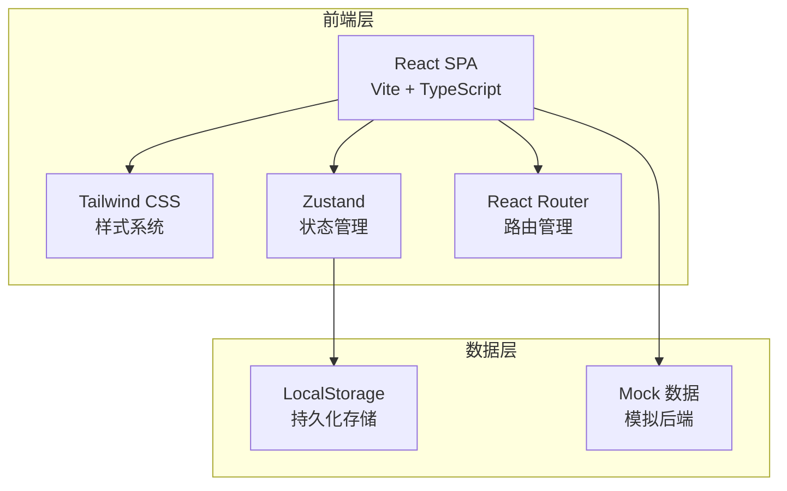
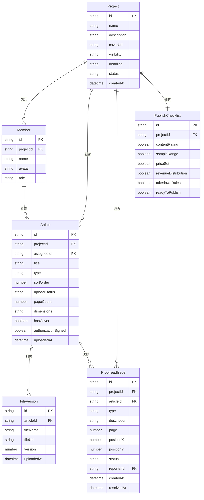

## 1. 架构设计



## 2. 技术说明

- **前端框架**：React 18 + TypeScript + Vite
- **样式方案**：Tailwind CSS 3 + CSS Modules（复杂组件）
- **状态管理**：Zustand（轻量级全局状态）
- **路由方案**：React Router v6
- **动画库**：Framer Motion
- **图标库**：Lucide React
- **数据持久化**：LocalStorage + Zustand persist 中间件
- **后端**：无后端，纯前端 Mock 数据模拟全部业务逻辑
- **字体**：Noto Serif SC + Noto Sans SC（Google Fonts）

## 3. 路由定义

| 路由 | 用途 |
|------|------|
| `/` | 工作台首页 - 项目总览与待办 |
| `/project/:id` | 项目管理页 - 刊物信息、人员、篇目 |
| `/project/:id/upload` | 收稿上传页 - 成员专属上传入口 |
| `/project/:id/proofread` | 校对流转页 - 预览标注与处理确认 |
| `/project/:id/publish` | 发行确认页 - 上线检查清单 |

## 4. 数据模型

### 4.1 数据模型定义



### 4.2 数据定义

```typescript
interface Project {
  id: string;
  name: string;
  description: string;
  coverUrl: string;
  visibility: "public" | "link" | "private";
  deadline: string;
  status: "collecting" | "proofreading" | "publishing" | "published";
  createdAt: string;
}

interface Member {
  id: string;
  projectId: string;
  name: string;
  avatar: string;
  role: "organizer" | "artist" | "writer" | "proofreader";
}

interface Article {
  id: string;
  projectId: string;
  assigneeId: string;
  title: string;
  type: "illustration" | "text" | "cover";
  sortOrder: number;
  uploadStatus: "pending" | "uploaded" | "revision";
  pageCount: number;
  dimensions: string;
  hasCover: boolean;
  authorizationSigned: boolean;
  uploadedAt: string | null;
}

interface FileVersion {
  id: string;
  articleId: string;
  fileName: string;
  fileUrl: string;
  version: number;
  uploadedAt: string;
}

interface ProofreadIssue {
  id: string;
  projectId: string;
  articleId: string;
  type: "typo" | "page_break" | "bleed";
  description: string;
  page: number;
  positionX: number;
  positionY: number;
  status: "open" | "resolved" | "confirmed";
  reporterId: string;
  createdAt: string;
  resolvedAt: string | null;
}

interface PublishChecklist {
  id: string;
  projectId: string;
  contentRating: boolean;
  sampleRange: boolean;
  priceSet: boolean;
  revenueDistribution: boolean;
  takedownRules: boolean;
  readyToPublish: boolean;
}
```

## 5. 项目结构

```
src/
├── components/          # 通用组件
│   ├── Layout/          # 布局组件（侧边栏、顶栏）
│   ├── StatusBadge/     # 状态徽章
│   ├── StampMark/       # 印章标记组件
│   └── ProgressBar/     # 进度条
├── pages/               # 页面组件
│   ├── Dashboard/       # 工作台首页
│   ├── Project/         # 项目管理页
│   ├── Upload/          # 收稿上传页
│   ├── Proofread/       # 校对流转页
│   └── Publish/         # 发行确认页
├── stores/              # Zustand 状态仓库
│   ├── projectStore.ts
│   ├── memberStore.ts
│   ├── articleStore.ts
│   ├── proofreadStore.ts
│   └── publishStore.ts
├── types/               # TypeScript 类型定义
│   └── index.ts
├── mock/                # Mock 数据
│   └── seed.ts
├── utils/               # 工具函数
├── App.tsx
├── main.tsx
└── index.css
```
